# CAIL2025
CAIL2025官网：http://cail.cipsc.org.cn/

本仓库为Justice团队参加CAIL2025 量刑情节识别与刑期预测赛道的工作流，基于扣子平台部署。

本文档介绍如何部署该工作流。

在运行main.py文件之前，需要将知识库和扣子工作流（workflow.zip）上传至扣子工作流。

## 一、工作流上传步骤

### 登录扣子空间：https://code.coze.cn/home
### 上传两份知识库文件。
- 点击左侧菜单栏-资源库，再点击右上角 资源-知识库。如下图所示：
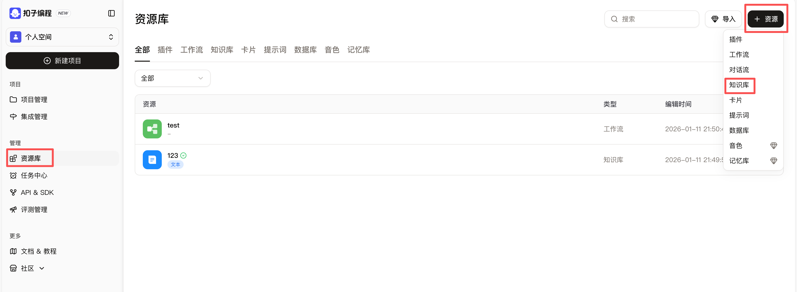
- 选择“创建扣子知识库”，选择类型为-表格格式，数据集名称命名为“我国各地区盗窃诈骗等罪名数额标准表”，导入类型选择-本地文档。点击创建并导入。如下图所示：

- 上传“我国各地区盗窃诈骗等罪名数额标准表.xlsx”后，点击下一步。
- 在“表结构配置”页面设置索引，如图：
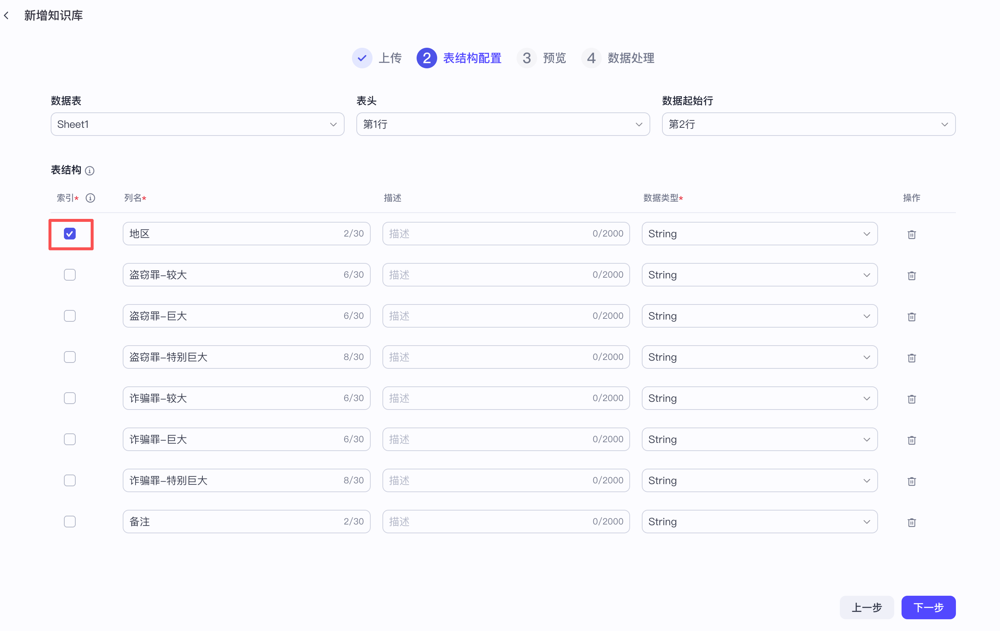
- 点下一步，在“数据处理”页面点击确认，如下。即可完成知识库上传。
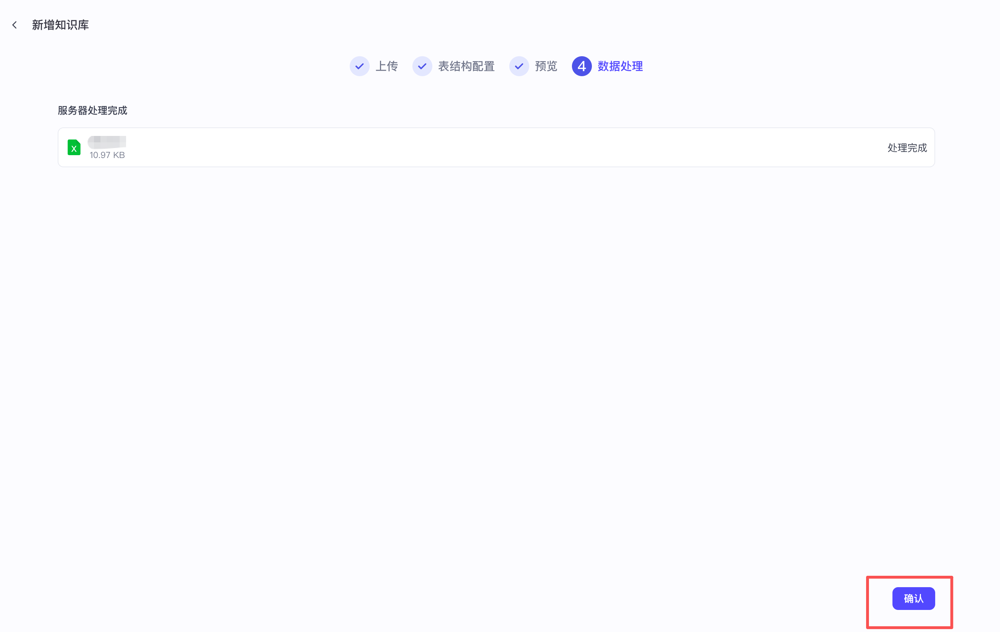
- 下面上传“关于常见犯罪的量刑指导意见.docx”。配置如下。点击“创建并导入”。
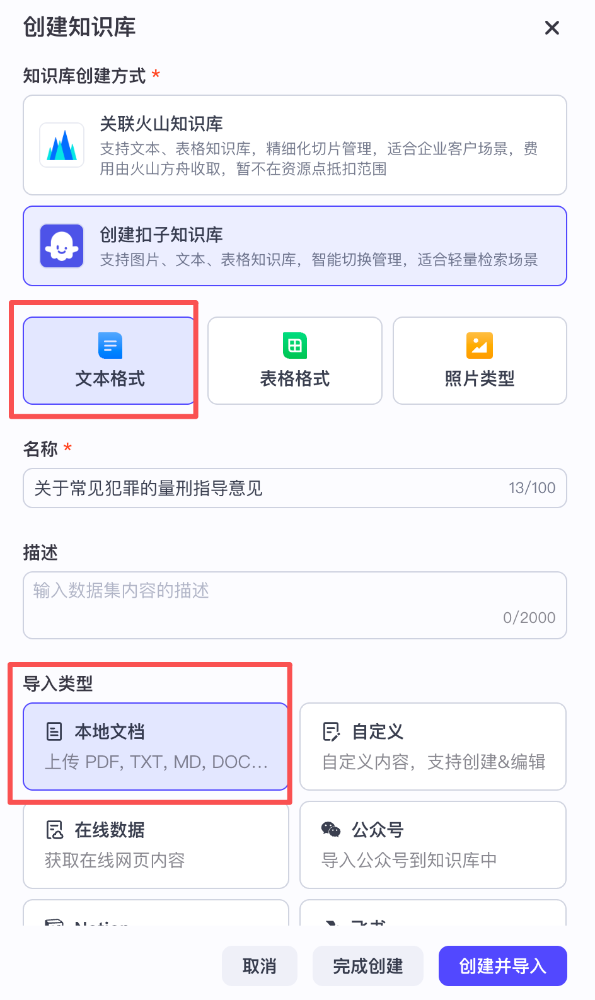
- 上传“关于常见犯罪的量刑指导意见.docx”，点击下一步
- 来到 创建设置 页面，分段策略配置如下图。配置好后点 下一步。
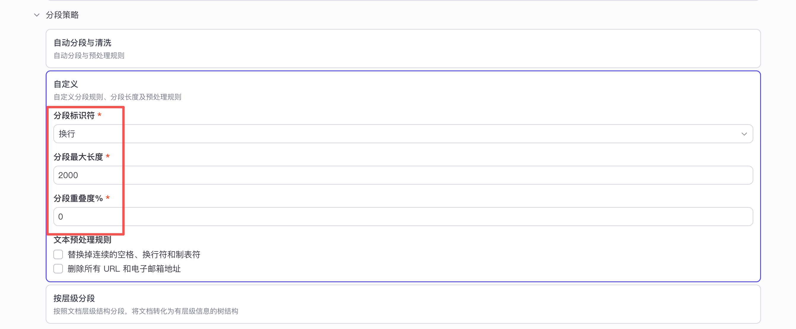
- 在“分段预览”页面，每一个罪都被分为了一块。点击下一步。
- 在“数据处理”页面点击 确认 即可完成知识库上传。
### 上传工作流
- 此功能需要购买个人进阶版套餐。购买入口如下
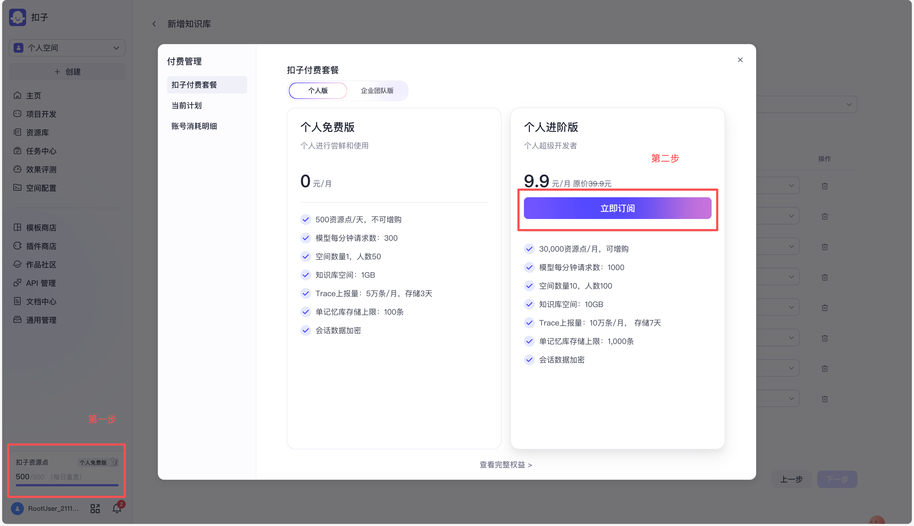
- 购买后，点击左侧菜单栏的 资源库，点击右上角 导入，如下图：
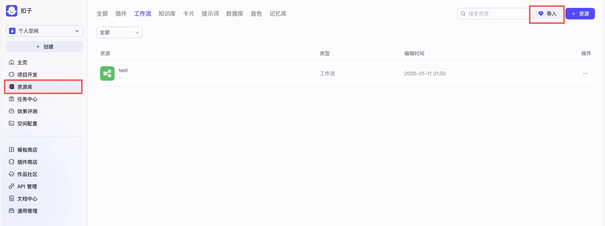
- 上传workflow.zip文件，点击 导入 即可完成工作流上传。如下图：
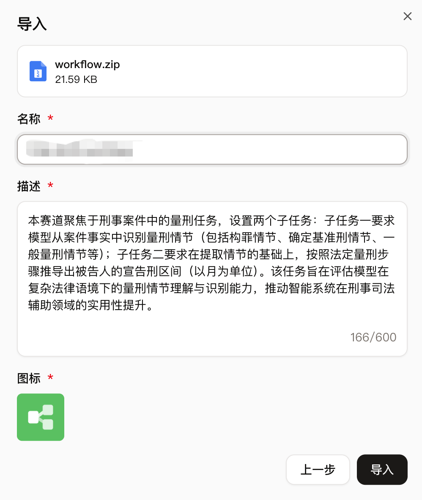
- 下面测试知识库检索节点是否正常，点击如下知识库检索节点，在右侧弹出的页面中点击右上角的三角形图案。    
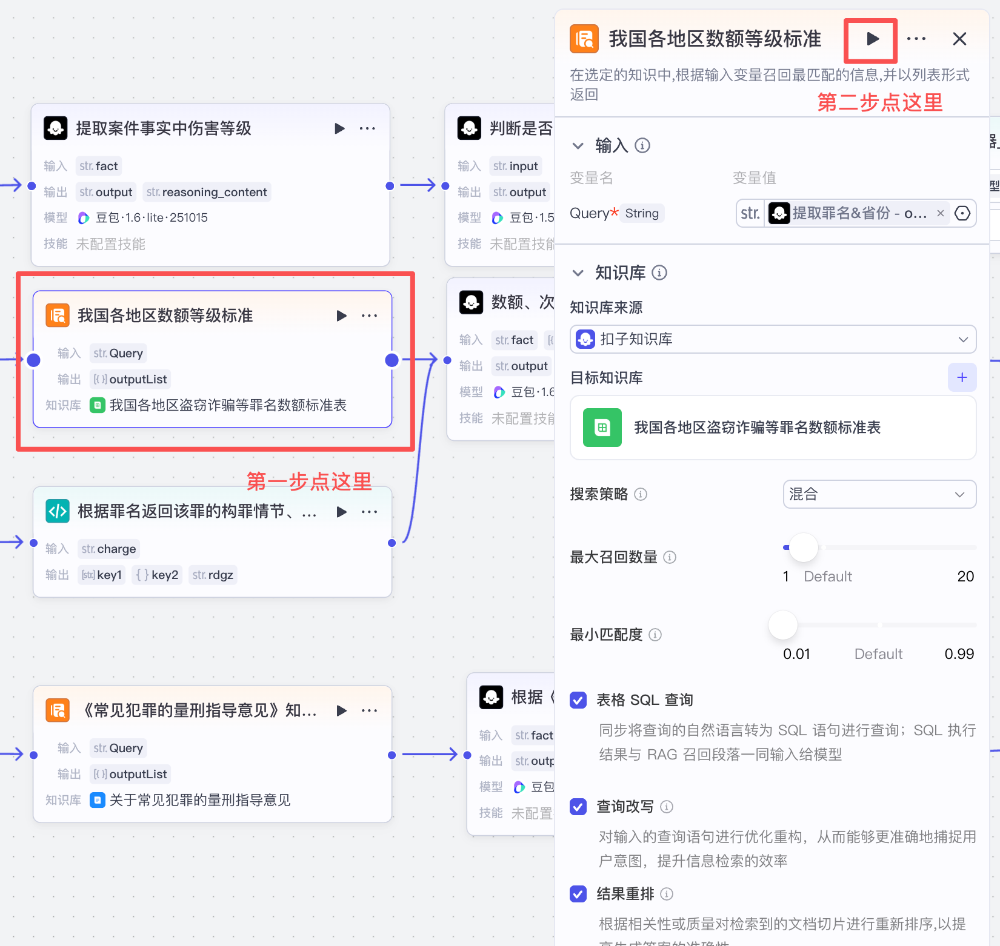
- 输入“北京市”，出现如下页面即知识库检索运行正常：
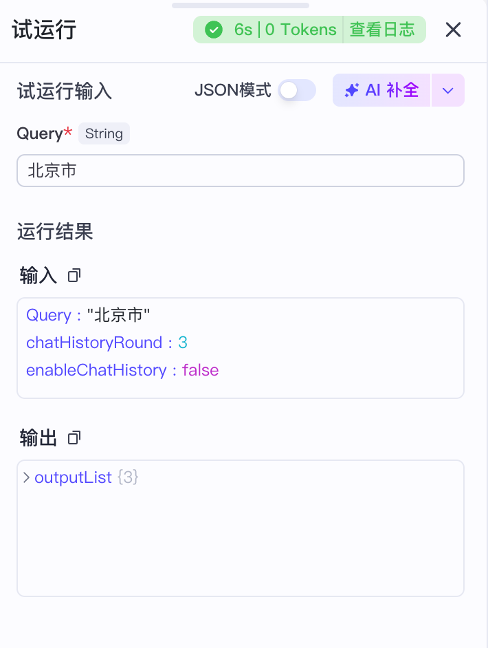
- 按同样的步骤测试《量刑指导意见》知识库检索节点，该节点的query为罪名。确认正常运行后，开始后面的步骤。
## 二、发布工作流
- 首先复制网页地址栏链接中的“workflow_id”参数的值，并保存。如图，复制的workflow_id的值为7594113411182542890（这个id只是示例，应替换为您复制的值）。

- 点击发布-坚持发布：
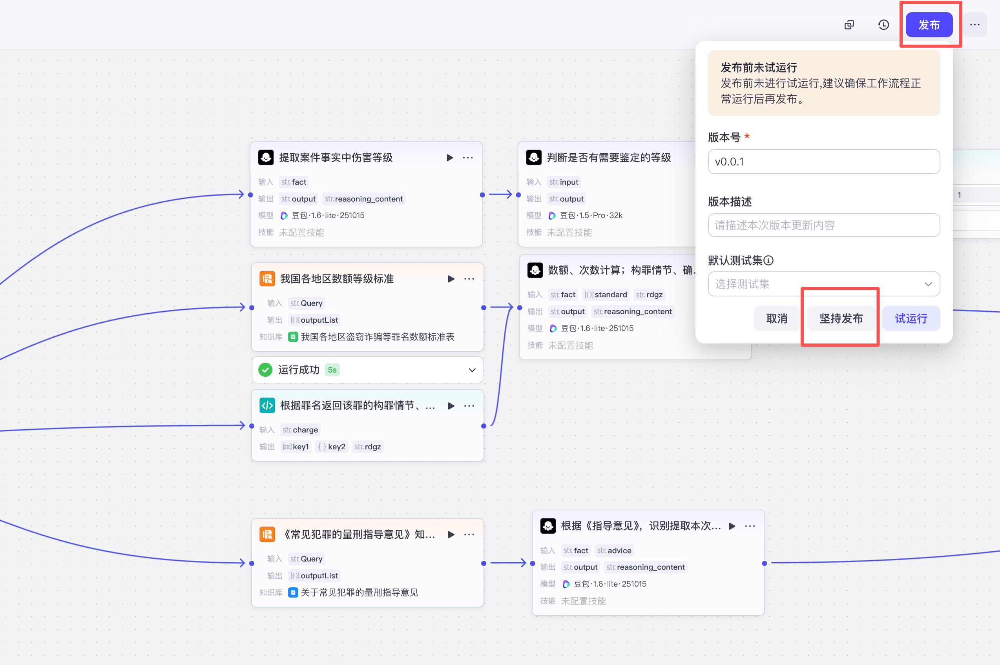
- 获取个人访问令牌。入口如图：

- 权限选择“工作流”，其他按需配置。配置好后点击“确认”ACCESS_TOKEN
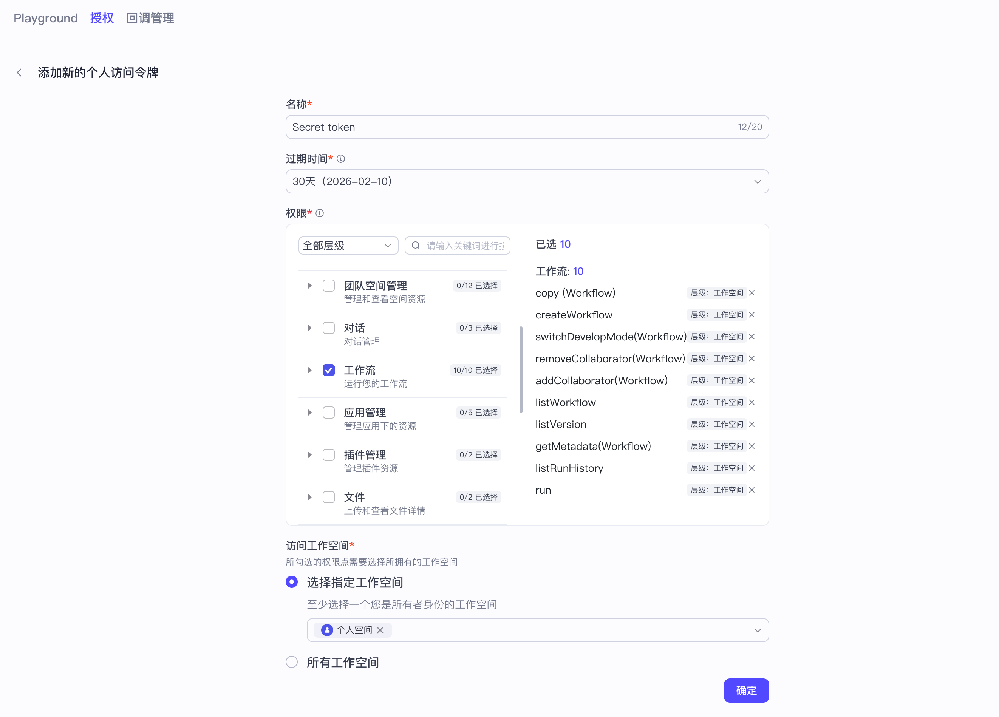
- 复制令牌并保存，如图：
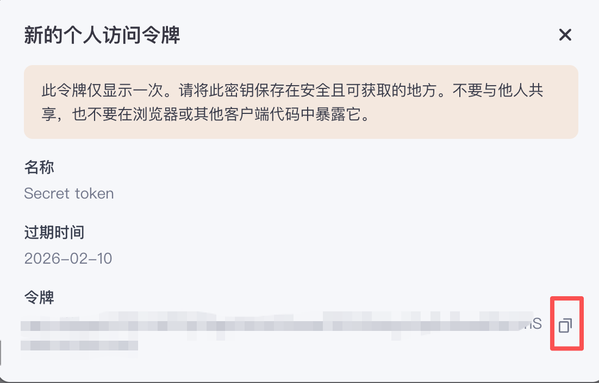
## 三、main.py文件配置
- 修改main.py文件中的ACCESS_TOKEN和WORKFLOW_ID这两个变量的值，修改为刚刚复制的令牌和WORKFLOW_ID。如下图：

- 在main.py所在目录运行python main.py --pred_file \[test_file_path\] ，运行完会在当前目录下生成prediction.jsonl文件。
